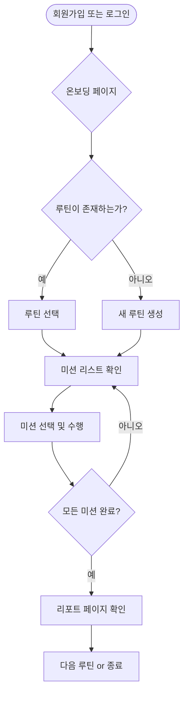

# 🧭 사용자 플로우차트 (텀텀 기본 흐름)

> 회원가입부터 루틴 생성 및 미션 수행까지의 기본 사용자 흐름을 나타낸 Mermaid 플로우차트입니다.

```mermaid
flowchart TD
  A([회원가입 또는 로그인])
  A --> B{온보딩 페이지}
  B --> C{루틴이 존재하는가?}
  C -- 예 --> D[루틴 선택]
  C -- 아니오 --> E[새 루틴 생성]
  D --> F[미션 리스트 확인]
  E --> F
  F --> G[미션 선택 및 수행]
  G --> H{모든 미션 완료?}
  H -- 아니오 --> F
  H -- 예 --> I[리포트 페이지 확인]
  I --> J[다음 루틴 or 종료]
```

this is test flowchart