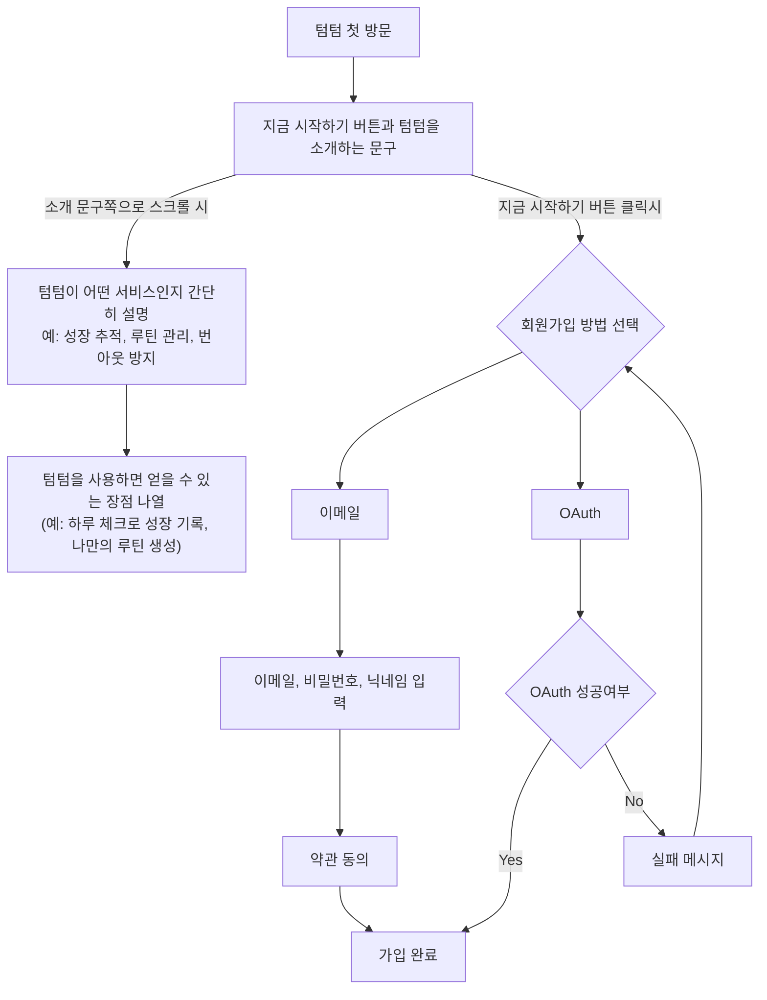

```mermaid
flowchart TD
    A[텀텀 첫 방문] --> B[지금 시작하기 버튼과 텀텀을 소개하는 문구]
    B -- 소개 문구쪽으로 스크롤 시--> C[텀텀이 어떤 서비스인지 간단히 설명<br>예: 성장 추적, 루틴 관리, 번아웃 방지]
    C --> D["텀텀을 사용하면 얻을 수 있는 장점 나열<br>(예: 하루 체크로 성장 기록, 나만의 루틴 생성)"]

    B -- "지금 시작하기" 버튼 클릭시--> E{"회원가입 방법 선택"}

    %% 이메일 회원가입
    E --> F[이메일]
    F --> G[이메일, 비밀번호, 닉네임 입력]
    G --> H[약관 동의]
    H --> I[가입 완료]

    %% OAuth 회원가입
    E --> J[OAuth]
    J --> K{OAuth 성공여부}
    K -- Yes -->  I
    K -- No --> L[실패 메시지] --> E
```
